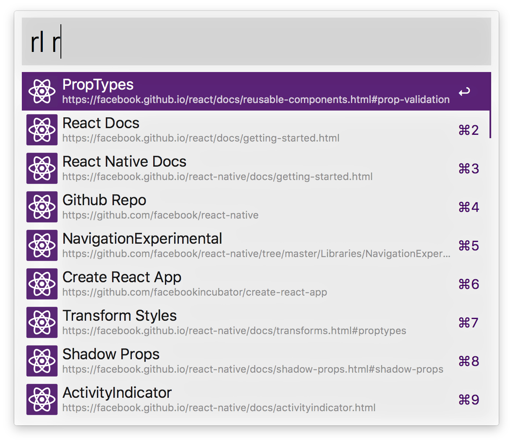

# arvis-react-doc

arvis workflow to access the React & React Native Documentation and community links.

### Download

```
$ npm i -g arvis-react-doc
```

### Usage

To search, type `rl`, <kbd>Enter</kbd> and your query. Select a component and press <kbd>Enter</kbd> to go to open the URL.



## 🔗 This workflow is converted from [alfred-workflow](https://github.com/winkerVSbecks/alfred-react-launcher).

* Note that there might be some code change or different actions from the original workflow.

* Marked original workflow's creator to author.
